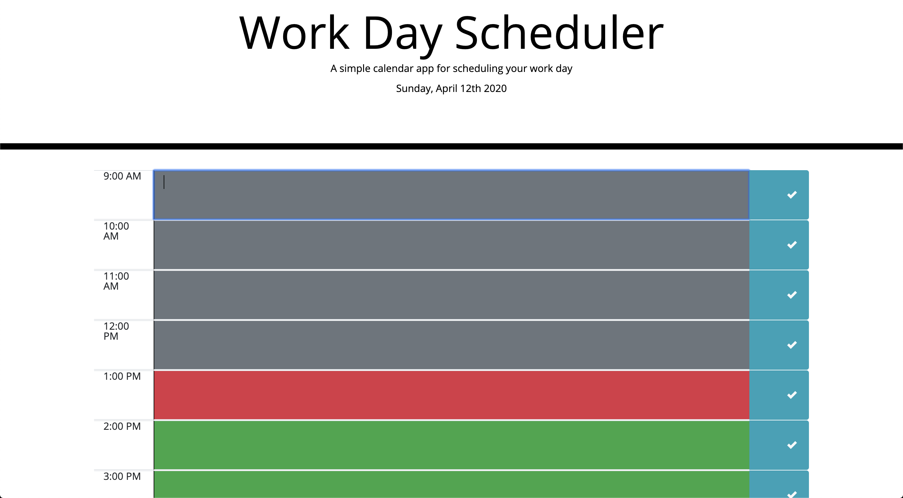

# Work Day Scheduler Starter Code

A program that allows you to set a work day schedule and saves the data locally so it will still load after closing then re-opening the page.
Times are color coded grey, green or red depending how the schdule time compared to the local time.

# Screenshot

# Link To Site

https://joshprice315.github.io/work-day-scheduler
